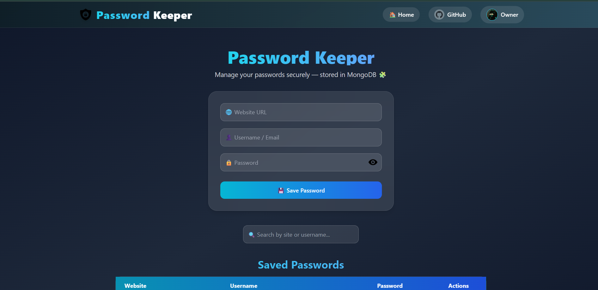

# Password Keeper 


A secure, modern, and beautiful password manager application built with the MERN stack (MongoDB, Express, React, Node.js). 
**Password Keeper** allows you to safely store, manage, and retrieve your credentials with a sleek glassmorphism UI.



## ✨ Features

- **Secure Storage**: Passwords are stored in a MongoDB database.
- **Modern UI**: Built with React and Tailwind CSS, featuring a dark theme and glassmorphism effects.
- **CRUD Operations**: Add, Edit, Delete, and View your saved passwords easily.
- **Copy to Clipboard**: One-click copy for usernames and passwords.
- **Search Functionality**: Quickly find your accounts by site name or username.
- **Responsive Design**: Works seamlessly on desktop and mobile devices.
- **Password Visibility**: Toggle password masking for privacy.

## 🛠️ Tech Stack

**Frontend:**
- [React](https://reactjs.org/) (Vite)
- [Tailwind CSS](https://tailwindcss.com/)
- [React Router](https://reactrouter.com/)
- [React Toastify](https://fkhadra.github.io/react-toastify/)

**Backend:**
- [Node.js](https://nodejs.org/)
- [Express.js](https://expressjs.com/)
- [MongoDB](https://www.mongodb.com/) (Mongoose)
- [Cors](https://www.npmjs.com/package/cors) & [Dotenv](https://www.npmjs.com/package/dotenv)

## 🚀 Getting Started

Follow these instructions to get the project up and running on your local machine.

### Prerequisites

Ensure you have the following installed:
- [Node.js](https://nodejs.org/en/download/)
- [MongoDB](https://www.mongodb.com/try/download/community) (Locally or Atlas)

### Installation

1.  **Clone the repository:**
    ```bash
    git clone https://github.com/your-username/PasswordKeeper.git
    cd PasswordKeeper
    ```

2.  **Setup Backend:**
    Navigate to the backend directory and install dependencies.
    ```bash
    cd "Password Mannager/backend"
    npm install
    ```
    Create a `.env` file in the `backend` folder and add your MongoDB URI:
    ```env
    MONGO_URI=mongodb://127.0.0.1:27017/passwordkeeper
    PORT=5000
    ```
    Start the backend server:
    ```bash
    npm start
    ```
    *The server should run on `http://localhost:5000`*

3.  **Setup Frontend:**
    Open a new terminal, navigate to the frontend directory:
    ```bash
    cd "Password Mannager"
    npm install
    ```
    Start the development server:
    ```bash
    npm run dev
    ```
    *The app should be available at `http://localhost:5173`*

## 📸 Screenshots


## 🤝 Contributing

Contributions are welcome! Feel free to open an issue or submit a pull request.

## 📄 License

This project is open source and available for learning/educational purposes.
